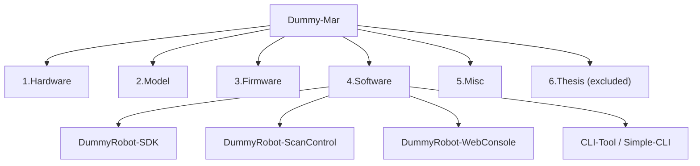

# Dummy-Mar

`Dummy-Mar` is an integrated engineering workspace for the `Dummy` 6-axis robotic arm. It contains hardware design files, mechanical models, controller and motor firmware, and software projects for robot control, scan motion, and structured-light prototyping.

This repository is being prepared for GitHub publication as an engineering source workspace. Personal thesis materials and local packaged artifacts are intentionally excluded.

## Project Scope

The public-facing scope of this repository is:

- robot hardware source files
- mechanical design assets
- embedded firmware source code
- Python SDK and scan-control software
- web upper-computer source code
- engineering reference documents that are safe to redistribute

The repository is **not intended** to include:

- thesis drafts and school templates
- local build outputs and test artifacts
- temporary reference repositories
- packaged desktop releases
- local toolchains and downloaded installers

## Repository Structure



### `1.Hardware`

Robot electronics design files, including controller and motor-driver boards.

### `2.Model`

Mechanical CAD data, including 3D models, export files, and engineering drawings.

### `3.Firmware`

Embedded firmware for the main controller and joint driver boards.

Main subprojects:

- `dummy-ref-core-fw`
- `dummy-35motor-fw`
- `dummy-42motor-fw`
- `esp32-iot`

### `4.Software`

Software projects for robot control and upper-computer functions.

Main subprojects:

- `DummyRobot-SDK`
  - Python SDK for serial control, camera access, structured-light prototyping, and offline reconstruction utilities
- `DummyRobot-ScanControl`
  - scan-motion controller built on top of `DummyRobot-SDK`
- `DummyRobot-WebConsole`
  - web-based upper-computer console
- `CLI-Tool`
  - existing command-line maintenance utilities
- `Simple-CLI`
  - lightweight serial command tools

### `5.Misc`

Supporting engineering material such as DH parameters, wiring references, BOM assets, and selected reference documents.

### `6.Thesis`

Personal thesis and school-template materials.

This directory is intentionally excluded from GitHub publication through the root `.gitignore`.

## Main Software Entry Points

If you are mainly interested in software development, start here:

- `4.Software/DummyRobot-SDK`
- `4.Software/DummyRobot-ScanControl`
- `4.Software/DummyRobot-WebConsole`

## Quick Start

If you want to inspect the software layer first:

1. Open `4.Software/DummyRobot-SDK` for the Python SDK and structured-light prototyping utilities.
2. Open `4.Software/DummyRobot-ScanControl` for the scan-motion controller built on top of the SDK.
3. Open `4.Software/DummyRobot-WebConsole` for the web-based upper-computer interface.
4. Use `4.Software/CLI-Tool` or `4.Software/Simple-CLI` if you need the older command-line maintenance tools.

If you want to build or run the software locally, the common pattern is:

```bash
cd 4.Software/DummyRobot-SDK
pip install -e .

cd ..\DummyRobot-ScanControl
pip install -e .
```

For the web console:

```bash
cd 4.Software/DummyRobot-WebConsole
pip install -e .
```

## GitHub Publication Boundary

The root `.gitignore` currently excludes the following categories by default:

- `6.Thesis/`
- local screenshots and slide files
- temporary structured-light reference repositories
- Python caches and build artifacts
- local test outputs and generated scan artifacts
- packaged zip archives under `4.Software/`
- local toolchains under `_tools/`
- compiled desktop release directory `4.Software/DummyStudio/`

This keeps the repository focused on source assets instead of local working files and distribution packages.

## Publication Notes

Before the first public push, review these items:

1. whether large exported CAD files should stay in the repository or move to releases / cloud storage
2. whether vendor PDFs, installers, or datasheets inside `5.Misc/` are safe to redistribute
3. whether third-party code bundled in `CLI-Tool/` should remain vendored or be replaced by installation instructions
4. whether all personal academic materials and local outputs are excluded correctly

For a more detailed release checklist, see `GITHUB_PUBLISHING_CN.md`.
